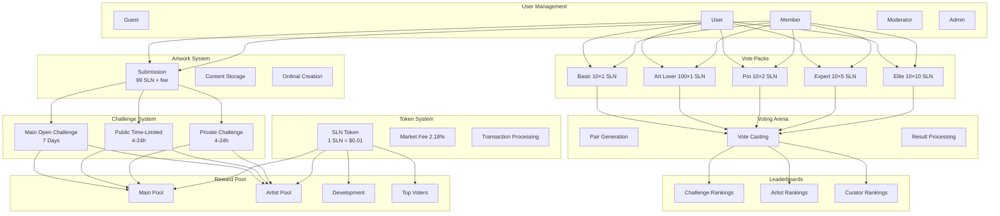
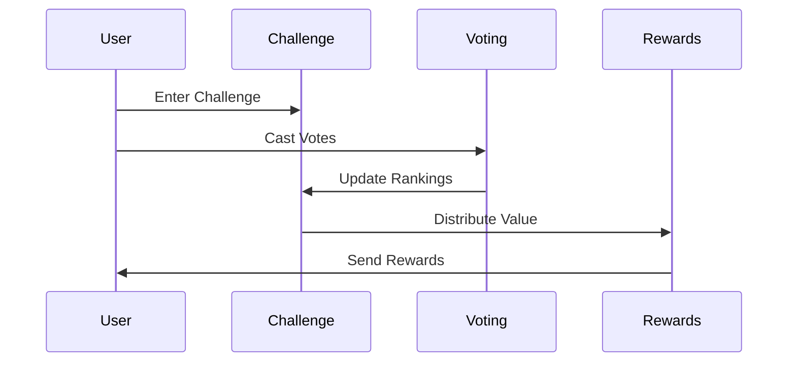
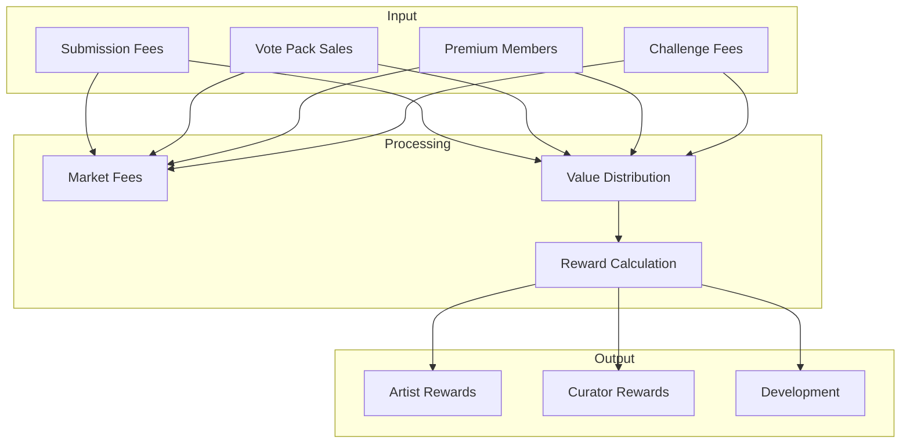

# Meta.Salon System Architecture
## Core Components & Interactions

## Core Systems Overview

### 1. User Management
- Guest: View only
- User: Basic participation
- Member: Premium features
- Moderator: Content control
- Admin: Full control

### 2. Token System
- SLN Token (1 cent USD)
- Market fee (2.18% rounded up)
- Transaction processing
- Wallet integration

### 3. Challenge System
- Main Open Challenge (7 days)
- Public Time-Limited (4-24h)
- Private Challenge (4-24h)
- Entry requirements
- Reward structures

### 4. Artwork Submission
- Submission fee: 99 SLN + 3
- Content validation
- Ordinal creation
- Challenge assignment

### 5. Vote Packs
- Basic: 10×1 SLN votes
- Art Lover: 100×1 SLN votes
- Pro: 10×2 SLN votes
- Expert: 10×5 SLN votes
- Elite: 10×10 SLN votes

### 6. Voting Arena
- Pair presentation
- Vote casting
- Weight application
- Result calculation

### 7. Leaderboards
- Challenge rankings
- Artist rankings
- Curator rankings
- Performance metrics

### 8. Reward Pool
- Main reward pool
- Artist distribution
- Development fund
- Top voter rewards

## Key System Interactions

## Value Flow

Would you like me to:
1. Detail any specific component?
2. Show more interaction flows?
3. Explain value distribution?
4. Add any missing features?

The system integrates all components through the challenge and voting mechanics, with the token system providing the economic backbone.