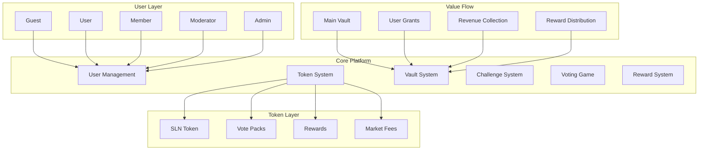
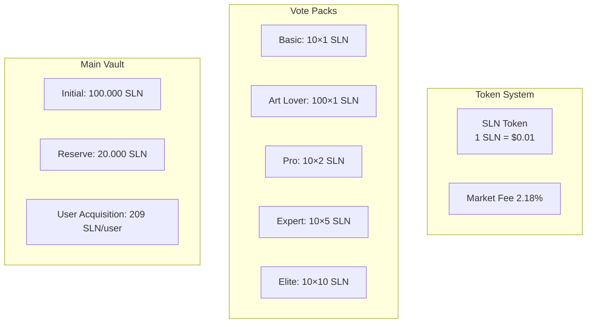
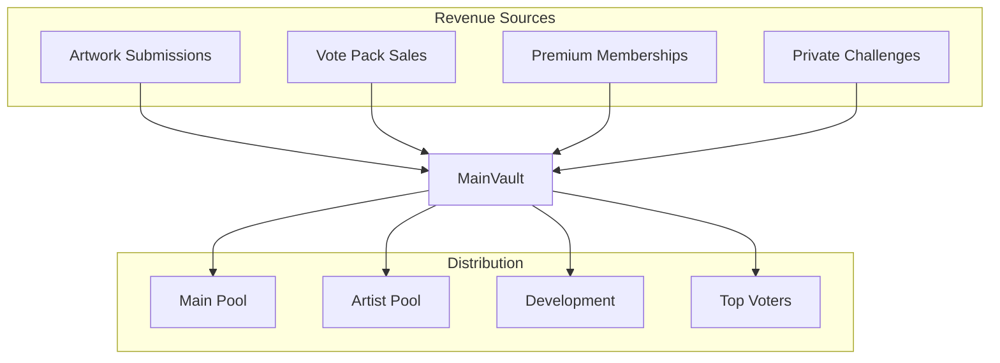
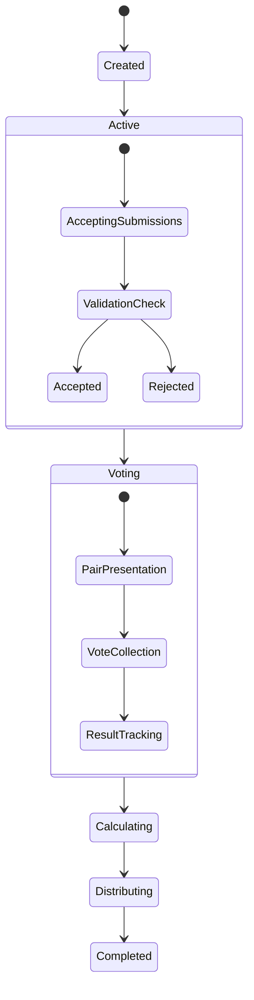
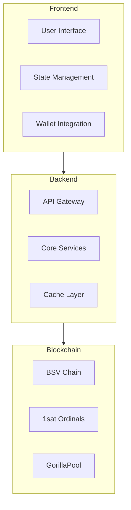

# Meta.Salon System Documentation
## Part 1: System Overview

## 1. Core Components



## 2. User Roles & Permissions

### 2.1 Role Hierarchy
```plaintext
1. Guest (Not Logged In)
   - View public content
   - Browse artworks
   - View leaderboards

2. User (Logged In)
   - Submit artworks (99 SLN + 3)
   - Purchase vote packs
   - Participate in challenges
   - Initial grant: 209 SLN (199 + 10 basic pack)

3. Member (Premium)
   - All user capabilities
   - Reduced fees
   - Premium features
   - Monthly fee: 999 SLN + 22

4. Moderator
   - Content moderation
   - Challenge management
   - User reports
   - System monitoring

5. Admin
   - Full system control
   - Economic management
   - User management
   - Platform configuration
```

## 3. Token Economics

### 3.1 Token Structure


### 3.2 Value Flow


## 4. Challenge System

### 4.1 Challenge Types
```plaintext
1. Main Open Challenge
   - 7-day duration
   - Entry: 99 SLN + 3
   - 100% to reward pool
   - Weekly distribution

2. Public Time-Limited
   - 4-24 hours
   - Free entry
   - Public reward pool
   - Community-driven

3. Private Challenge
   - 4-24 hours
   - Setup: 299 SLN + 7
   - Custom vote packs
   - Invite-only
```

### 4.2 Challenge Flow


## 5. System Architecture

### 5.1 Technical Stack
```plaintext
1. Frontend
   - React Native
   - State Management: Redux
   - UI: Chakra UI
   - Animations: Framer Motion

2. Blockchain
   - BSV Chain
   - 1sat Ordinals
   - Yours Wallet
   - GorillaPool API

3. Backend
   - Node.js
   - Database: PostgreSQL
   - Caching: Redis
   - Message Queue: RabbitMQ
```

### 5.2 Integration Points


Would you like me to:
1. Proceed with Part 2: Platform Mechanics?
2. Detail any specific component?
3. Show more integration patterns?
4. Expand any section?

This first part provides the foundation for understanding Meta.Salon's structure. The next parts will detail specific mechanics and implementation.