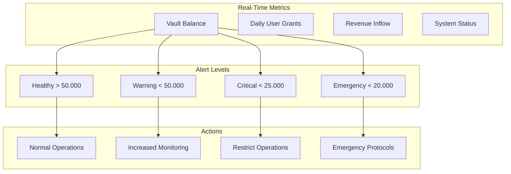
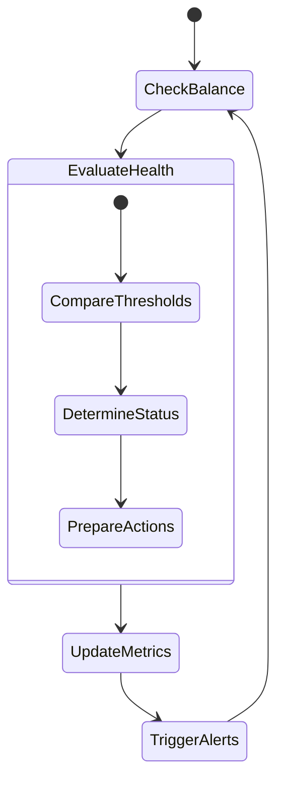
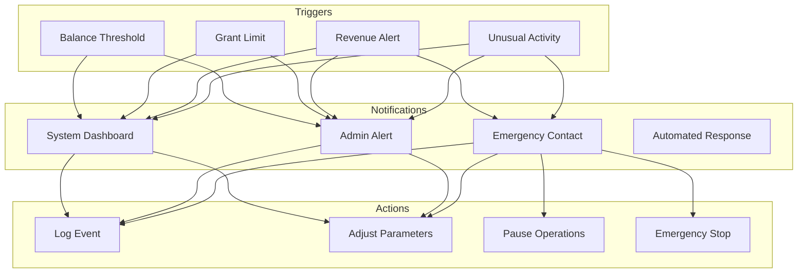

# Meta.Salon Vault Monitoring Systems

## 1. Real-Time Monitoring Dashboard



## 2. Monitoring Contract Implementation

```solidity
contract VaultMonitor {
    // Monitoring Events
    event BalanceUpdate(uint256 balance, string level);
    event UserGranted(address user, uint256 amount);
    event RevenueReceived(string source, uint256 amount);
    event ThresholdCrossed(string level, uint256 timestamp);
    
    struct MonitoringMetrics {
        uint256 currentBalance;
        uint256 dailyUserGrants;
        uint256 dailyRevenue;
        uint256 dailyOutflow;
        string healthStatus;
        uint256 lastUpdate;
    }
    
    struct DailyStats {
        uint256 startBalance;
        uint256 endBalance;
        uint256 userGrantsCount;
        uint256 totalRevenue;
        uint256 totalOutflow;
    }
    
    // Monitoring Functions
    function getMetrics() public view returns (MonitoringMetrics memory);
    function getDailyStats() public view returns (DailyStats memory);
    function getHealthStatus() public view returns (string memory);
}
```

## 3. Monitoring Systems

### 3.1 Balance Monitoring


### 3.2 User Grant Monitoring
```typescript
interface UserGrantMonitor {
    metrics: {
        dailyGrants: number;
        totalGrants: number;
        grantRate: number;
        averageGrantsPerDay: number;
    };

    limits: {
        dailyMaxGrants: number;
        minBalanceRequired: number;
        cooldownPeriod: number;
    };

    alerts: {
        approachingLimit: boolean;
        insufficientBalance: boolean;
        unusualActivity: boolean;
    };
}
```

### 3.3 Revenue Monitoring
```typescript
interface RevenueMonitor {
    metrics: {
        dailyRevenue: number;
        revenueBySource: Map<string, number>;
        projectedIncome: number;
        breakEvenAnalysis: {
            submissionRevenue: number;
            votePackRevenue: number;
            premiumRevenue: number;
            challengeRevenue: number;
        };
    };
}
```

## 4. Alert System



## 5. Reporting System

### 5.1 Real-Time Reports
```typescript
interface RealTimeReports {
    balanceStatus: {
        currentBalance: number;
        dailyChange: number;
        healthLevel: string;
        projectedBalance: number;
    };

    userActivity: {
        activeGrants: number;
        pendingGrants: number;
        grantSuccess: number;
        failureRate: number;
    };

    revenueMetrics: {
        currentRevenue: number;
        projectedRevenue: number;
        revenueBySource: Map<string, number>;
        trends: Array<DataPoint>;
    };
}
```

### 5.2 Daily Reports
```typescript
interface DailyReport {
    startBalance: number;
    endBalance: number;
    userGrantsIssued: number;
    totalRevenue: number;
    netChange: number;
    healthStatus: string;
    alerts: Alert[];
    recommendations: string[];
}
```

## 6. Administrative Controls

### 6.1 Parameter Management
```typescript
interface AdminControls {
    setDailyLimits(limits: SystemLimits): Promise<void>;
    adjustThresholds(thresholds: SystemThresholds): Promise<void>;
    updateAlertSettings(settings: AlertSettings): Promise<void>;
    modifyMonitoringRules(rules: MonitoringRules): Promise<void>;
}
```

### 6.2 Emergency Controls
```typescript
interface EmergencyControls {
    pauseUserGrants(): Promise<void>;
    restrictOperations(level: number): Promise<void>;
    emergencyShutdown(): Promise<void>;
    resumeOperations(): Promise<void>;
}
```

Would you like me to:
1. Detail specific monitoring scenarios?
2. Show alert handling procedures?
3. Expand reporting capabilities?
4. Add more administrative controls?

This monitoring system ensures comprehensive oversight of the vault's operations while providing timely alerts and controls for maintaining system health.