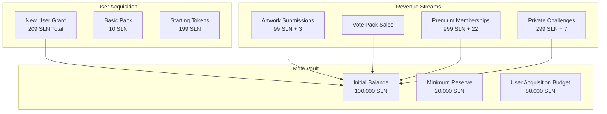
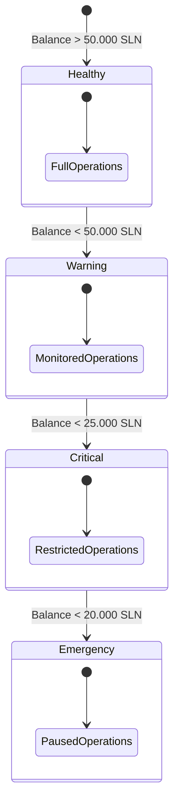

# Meta.Salon Vault System Specifications

## 1. Main Vault Structure



## 2. Smart Contract Implementation

### 2.1 Core Contract Structure
```solidity
contract MetaSalonVault {
    // State Variables
    uint256 public totalBalance;
    uint256 public minimumReserve;
    uint256 public constant BASIC_PACK_VALUE = 10;
    uint256 public constant STARTING_TOKENS = 199;
    uint256 public constant TOTAL_GRANT = BASIC_PACK_VALUE + STARTING_TOKENS;

    // Access Control
    address public operator;
    mapping(address => bool) public admins;
    bool public paused;

    // User Management
    mapping(address => bool) public hasReceivedGrant;
    uint256 public dailyUserLimit;
    uint256 public dailyUserCount;

    // Events
    event UserGrant(address user, uint256 amount);
    event RevenueCollected(string source, uint256 amount);
    event EmergencyAction(string action, uint256 timestamp);
}
```

### 2.2 Grant Functions
```solidity
contract MetaSalonVault {
    function grantNewUser(address user) external {
        require(!paused, "Vault: System paused");
        require(msg.sender == operator, "Vault: Not operator");
        require(!hasReceivedGrant[user], "Vault: Already granted");
        require(dailyUserCount < dailyUserLimit, "Vault: Daily limit reached");
        require(totalBalance >= minimumReserve + TOTAL_GRANT, "Vault: Insufficient balance");

        _grantBasicPack(user);
        _grantStartingTokens(user);

        totalBalance -= TOTAL_GRANT;
        hasReceivedGrant[user] = true;
        dailyUserCount++;

        emit UserGrant(user, TOTAL_GRANT);
    }

    function _grantBasicPack(address user) internal {
        // Grant 10 SLN value pack
    }

    function _grantStartingTokens(address user) internal {
        // Grant 199 SLN tokens
    }
}
```

### 2.3 Revenue Functions
```solidity
contract MetaSalonVault {
    function collectRevenue(uint256 amount, string source) external {
        require(msg.sender == operator, "Vault: Not operator");
        totalBalance += amount;
        emit RevenueCollected(source, amount);
    }

    function processMarketFee(uint256 amount) external {
        require(msg.sender == operator, "Vault: Not operator");
        // Market fee processing (2.18% rounded up)
    }
}
```

## 3. Balance Management



## 4. Operational Metrics

### 4.1 User Acquisition Capacity
```plaintext
Initial Balance: 100.000 SLN
Minimum Reserve: 20.000 SLN
Available for Grants: 80.000 SLN

User Grant Cost: 209 SLN
- Basic Pack: 10 SLN
- Starting Tokens: 199 SLN

Maximum Initial Users: 382
(80.000 SLN / 209 SLN per user)
```

### 4.2 Revenue Impact
```plaintext
Break-even Analysis:
1. Artwork Submission
   - Revenue: 99 SLN
   - Covers: 47% of new user cost

2. Premium Membership
   - Revenue: 999 SLN
   - Covers: 4.77 new users

3. Private Challenge
   - Revenue: 299 SLN
   - Covers: 1.43 new users
```

## 5. Safety Controls

### 5.1 Emergency Functions
```solidity
contract MetaSalonVault {
    function emergencyStop() external {
        require(msg.sender == operator, "Vault: Not operator");
        paused = true;
        emit EmergencyAction("stop", block.timestamp);
    }

    function emergencyWithdraw(uint256 amount) external {
        require(msg.sender == operator, "Vault: Not operator");
        require(paused, "Vault: System must be paused");
        require(totalBalance - amount >= minimumReserve, "Vault: Below reserve");
        
        totalBalance -= amount;
        emit EmergencyAction("withdraw", block.timestamp);
    }
}
```

### 5.2 Safety Thresholds
```plaintext
1. Balance Thresholds:
   - Healthy: > 50.000 SLN
   - Warning: < 50.000 SLN
   - Critical: < 25.000 SLN
   - Emergency: < 20.000 SLN

2. Operation Limits:
   - Daily User Cap
   - Transaction Limits
   - Minimum Reserve
```

Would you like me to:
1. Add more contract functions?
2. Detail monitoring systems?
3. Show revenue scenarios?
4. Expand safety measures?

This specification provides a secure and sustainable framework for managing the platform's token economy through the main vault system.